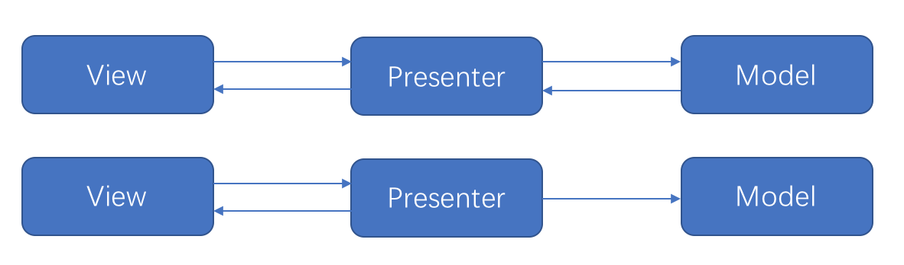

# AndroidArchitecture
安卓架构（MVC、MVP、MVVM）

## MVP架构（Retrofit2 +RxJava2+Room）

### 架构简介

- View: 对于View层也是视图层，在View层中只负责对数据的展示，提供友好的界面与用户进行交互。在Android开发中通常将Activity或者Fragment作为View层。
- Model: 对于Model层也是数据层。它区别于MVC架构中的Model，在这里不仅仅只是数据模型。在MVP架构中Model它负责对数据的存取操作，例如对数据库的读写，网络的数据的请求等。
- Presenter:对于Presenter层他是连接View层与Model层的桥梁并对业务逻辑进行处理。在MVP架构中Model与View无法直接进行交互。所以在Presenter层它会从Model层获得所需要的数据，进行一些适当的处理后交由View层进行显示。这样通过Presenter将View与Model进行隔离，使得View和Model之间不存在耦合，同时也将业务逻辑从View中抽离。

### 开源库

+ [Retrofit2](https://github.com/square/retrofit)
+ [RxJava2](https://github.com/ReactiveX/RxJava)
+ [Room](https://developer.android.google.cn/jetpack/androidx/releases/room?hl=zh_cn)
+ [Rxpermissions2](https://github.com/tbruyelle/RxPermissions)
+ [Materialprogressbar](https://github.com/zhanghai/MaterialProgressBar)

### 优缺点

+ 优点
  - 达到了低耦合的要求，分层明细
+ 缺点
  - 虽然达到了低耦合的需求，但是接口定义过于繁多
  - 比较适合中小型项目

