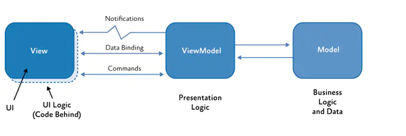
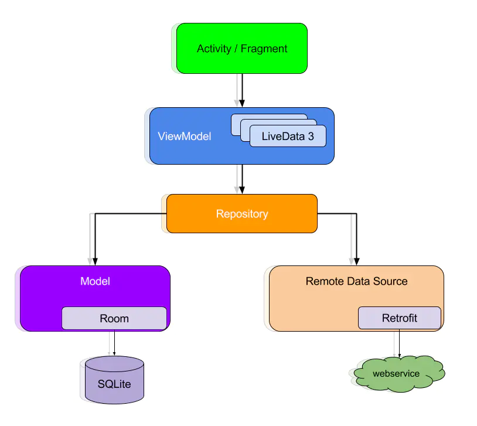

# AndroidArchitecture
安卓架构（MVC、MVP、MVVM）
## MVVM架构[Java版本] (Retrofit2+RxJava2+Room+DataBing+LiveData+ViewModel)

### 架构简介

+ Model:数据层，包含数据实体和对数据实体的操作
+ View:界面层，对应于Activity，XML,View，负责数据显示以及用户交互。
+ ViewModel：关联层，将Model和View进行绑定，Model或者View更改时，实时刷新对方。

### 开源库

+ [Retrofit2](https://github.com/square/retrofit)
+ [RxJava2](https://github.com/ReactiveX/RxJava)
+ [Room](https://developer.android.google.cn/jetpack/androidx/releases/room?hl=zh_cn)
+ [DataBinding](https://developer.android.google.cn/topic/libraries/data-binding)
+ [LiveData](https://developer.android.google.cn/topic/libraries/architecture/livedata)
+ [ViewModel](https://developer.android.google.cn/topic/libraries/architecture/viewmodel)

### 优势

+ 解决了view和model的彻底解耦，使用了[JetPack](https://developer.android.google.cn/jetpack)中的ViewModel组件，达到了双向绑定的效果